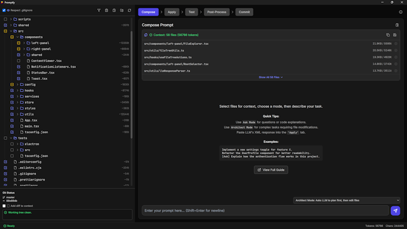

# Promptly - Preview Version 0.2.0



**"Context is king. Own the context."**

This is a **preview version (0.2.0)** of an offline-friendly, cross-platform, Git-native desktop tool designed to help developers craft detailed, context-aware prompts for Large Language Models (LLMs) using files from local codebases. It also supports applying file modifications from LLMs back into local files.

**⚠️ Preview Status & Self-Build Notice:**
This version is intended for developers and technically-inclined users who are comfortable building Electron applications from source. Binary releases are not yet available. We appreciate your interest and any feedback you might have. _Note that the structured output format requires a competent LLM (currently tested mainly with Gemini 2.5 Pro Preview 05-06, use 'Copy Markdown')._

## Core Features

- **Visual File System Exploration**: Navigate and select project files/directories to build LLM context with real-time token counting for individual files and the entire context.
- **Context Assembly**: Automatically generates XML-formatted context from selected files, including directory structure and (optionally) Git diff information.
- **Prompt Engineering**: Multiple modes (Architect, Ask, Edit, etc.) to tailor system prompts for various development tasks.
- **LLM Response Application**: Parse XML-based LLM responses to preview and apply file creations, diffs, or deletions.
- **Integrated Git Workflow**: View Git status, run terminal test commands, format code, and commit changes inside the tool.
- **Token Counting**: Utilizes `tiktoken` for accurate token estimates.
- **Keyboard Navigation and Shortcuts**: Optimized for maximum speed of use.
- **Cross-Platform**: Built with Electron for desktop compatibility (Windows, macOS, Linux).

## Getting Started

### Prerequisites

- Node.js (version 16 or higher)
- Git

### Installation

1.  **Clone the repository:**

    ```bash
    git clone https://github.com/timosaarinen/promptly.git
    cd promptly
    ```

2.  **Install dependencies:**

    ```bash
    npm install
    ```

3.  **Build:**
    ```bash
    npm run build
    ```
4.  **Run the application:**
    The executable version of Promptly will be created in the `release` directory:
    - **Windows**: Run the installer (`release/Promptly Setup 0.2.0.exe`) or the unpacked version (`release/win-unpacked/Promptly.exe`)
    - **macOS**: Run the installer (`release/Promptly-0.2.0.dmg`) or the unpacked version
    - **Linux**: Run the AppImage (`release/Promptly-0.2.0.AppImage`) or the unpacked version

### Alternative Run Methods

- **Production mode**: `npm run prod` - Run the tool in production mode without building an installer
- **Development mode**: `npm run dev` - Run with Vite development server for hot module replacement (HMR)

## Why Promptly?

Agentic coding assistants and "one-click" AI dev tools promise convenience, but often at the cost of control and transparency.

Promptly is built on a different principle: _You decide the context and the prompt that is sent to an LLM._

Modern LLMs are only as good as the context they receive. Black-box tools might automate away prompting, but they often hide the details of what's being sent and how suggestions are derived.

Promptly gives you full, visual control over context assembly and ensures that every edit is visible and auditable before it touches your codebase.

**Promptly is for developers who:**

- Want to _understand_ and _curate_ what the LLM sees
- Care about _auditability_ and _reproducibility_ of code changes
- Prefer transparent workflows over magical automation
- Want to combine the power of modern LLMs with robust, Git-based development practices

## Future Plans

- Stabilize core features and improve error handling
- Provide packaged binary releases for easier installation
- Add Playwright E2E testing suite
- Implement more robust diff algorithms beyond search/replace
- Further integrations and LLM interaction workflows
- Improve keyboard shortcuts and accessibility

## Support

For issues, questions, or feature requests, please visit our [GitHub Issues](https://github.com/timosaarinen/promptly/issues) page.
